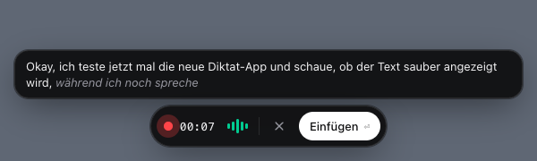

# Diktat

**Realtime voice dictation for macOS, in any app. Bring your own API key, pay about a dime per hour.**

Press a shortcut, talk, hit <kbd>Enter</kbd>. Your words appear live in a small floating bubble and get pasted wherever your cursor is: Slack, your editor, the browser, a terminal.

<p align="center">
  
</p>

## Why

Tools like Wispr Flow or Superwhisper are great, but they're closed source and cost $10–15 a month. Diktat does the core job in roughly 300 lines of plain JavaScript you can read in ten minutes:

- **Cheap.** Uses [Soniox](https://soniox.com) real-time speech-to-text at **$0.12 per hour of audio**. Dictating an hour every day costs about $4 a month.
- **Live.** You see words while you speak, not after a long upload.
- **Multilingual.** Mixed German and English (or any of 60+ languages) in the same sentence works.
- **Private by design.** No account, no telemetry, no server of ours. Audio goes straight from your Mac to the speech provider.
- **Tiny.** No framework, no bundler, no build step. `main.js`, one HTML file per window, done.

## Features

- Global shortcut (<kbd>⌘</kbd><kbd>⇧</kbd><kbd>Space</kbd>) from anywhere
- Floating bubble with live transcript, recording timer and an audio-level animation
- <kbd>Enter</kbd> inserts at the cursor, <kbd>Esc</kbd> discards
- Restores your previous clipboard after pasting, images included
- Lives in the menu bar with no Dock icon, and can launch at login
- API key encrypted with the macOS Keychain (`safeStorage`)

## Install

### From source

Requires Node.js 20+ and [pnpm](https://pnpm.io).

```bash
git clone https://github.com/jannesrudnick/diktat.git
cd diktat
pnpm install
pnpm start
```

### Build a `.dmg`

```bash
pnpm dist
```

The installer lands in `dist/`. The app is **not code-signed**, so the first time you open it, right-click → **Open** to get past Gatekeeper.

## Setup

1. **Get an API key** at [console.soniox.com](https://console.soniox.com).
2. **Paste it** into the window that opens on first launch. You can change it later via menu bar 🎙 → *API-Key…*.
3. **Grant permissions** when macOS asks, or later under *System Settings → Privacy & Security*:
   - **Microphone**: to hear you.
   - **Accessibility**: to press <kbd>⌘</kbd><kbd>V</kbd> for you. Without it, the transcript still ends up in your clipboard.

> When running via `pnpm start`, the permission entries are named **Electron**, not Diktat.

## Usage

| Action | Key |
|---|---|
| Start dictating | <kbd>⌘</kbd><kbd>⇧</kbd><kbd>Space</kbd> |
| Stop and paste at the cursor | <kbd>Enter</kbd> (or the shortcut again, or click **Einfügen**) |
| Discard | <kbd>Esc</kbd> (or click ✕) |

While the bubble is open, <kbd>Enter</kbd> and <kbd>Esc</kbd> are captured system-wide, so they won't reach the app behind it.

## How it works

```
 ⌘⇧Space ──▶ main.js ──show──▶ pill.html (floating, never takes focus)
                                   │  getUserMedia → AudioWorklet (16 kHz Float32)
                                   ▼
                         wss://stt-rt.soniox.com  ──tokens──▶ live text
 Enter ─────▶ main.js ◀──final text── pill.html
                 │
                 └─ clipboard ← text, osascript ⌘V, clipboard ← previous contents
```

The bubble window is created with `focusable: false`, so the app you were typing in keeps focus the whole time. That's why a plain simulated <kbd>⌘</kbd><kbd>V</kbd> lands in the right place.

| File | Purpose |
|---|---|
| `main.js` | Shortcuts, menu-bar icon, window placement, key storage, paste |
| `pill.html` | Bubble UI, microphone capture, Soniox WebSocket streaming |
| `settings.html` | API key input |
| `preload.js` | Minimal IPC bridge |

## Configuration

There's no settings UI beyond the API key yet. Edit the constants directly:

| What | Where |
|---|---|
| Shortcut | `SHORTCUT` in `main.js` ([accelerator syntax](https://www.electronjs.org/docs/latest/api/accelerator)) |
| Languages | `language_hints` in `pill.html` (default `['de', 'en']`) |
| Model | `model` in `pill.html` (default `stt-rt-v5`) |

## Privacy

- Audio is streamed **only while the bubble is visible**, and only to Soniox ([policies](https://soniox.com/policies)).
- Nothing is stored on disk except your encrypted API key in `~/Library/Application Support/Diktat/` (`diktat/` when run from source).
- No analytics, no update pings, no third-party scripts.

## Troubleshooting

| Problem | Fix |
|---|---|
| Text isn't pasted | Grant **Accessibility** to Diktat / Electron, then restart the app. The text is in your clipboard meanwhile. |
| "Kein Mikrofonzugriff" | Grant **Microphone** permission. |
| "Incorrect API key" | Re-enter the key via 🎙 → *API-Key…*. |
| Shortcut does nothing | Another app owns <kbd>⌘</kbd><kbd>⇧</kbd><kbd>Space</kbd>. Change `SHORTCUT` in `main.js`. |

## Roadmap

Ideas, not promises. PRs are welcome:

- [ ] More providers (ElevenLabs Scribe, OpenAI `gpt-4o-transcribe`, Deepgram)
- [ ] Settings UI for shortcut, languages and provider
- [ ] Optional LLM clean-up pass (remove filler words, fix punctuation)
- [ ] Push-to-talk (hold to speak)
- [ ] Signed and notarized releases
- [ ] Windows and Linux support

## Alternatives

If Diktat isn't for you, these might be:

- [OpenWhispr](https://github.com/OpenWhispr/openwhispr): open source, Electron, more features
- [VoiceInk](https://github.com/Beingpax/VoiceInk), [Handy](https://github.com/cjpais/Handy): open source, fully local Whisper (no live text)
- Wispr Flow, Superwhisper, Aqua Voice: polished commercial apps
- macOS Dictation: built in, free (press <kbd>Fn</kbd> twice)

## Contributing

Issues and PRs welcome. The codebase is intentionally small, so please keep it that way: no frameworks, and no new dependencies without a good reason.

```bash
pnpm install && pnpm start
```

## License

[MIT](LICENSE)
